# Architecture Diagram# Architecture Diagram Logs Page]

    InternalLogsPage --> InternalLogsApi[Internal Activity Logs API]
    InternalLogsApi --> PostgreSQL
```

### Notes

```text
- Client apps consume REST API over HTTP/HTTPS.
- API uses JWT Bearer authentication.
- Swagger is available for development/demo.
- Internal Activity Logs Page is used by Admin/Ops for tracing.
- PostgreSQL is the system of record.
```

---

## 2. Solution Layer Architecture

```mermaid
flowchart TD
    subgraph ApiLayer[OrderManagement.Api]
        Controllers[Controllers<br/>13 controllers]
        Contracts[HTTP Contracts]
        Middlewares[Middlewares]
        SwaggerSetup[Swagger Setup]
        AuthSetup[Authentication / Authorization Setup]
        InternalLogPage[Internal Activity Logs Page]
    end

    subgraph ApplicationLayer[OrderManagement.Application]
        AppServices[Application Services<br/>13 services]
        Validators[FluentValidation Validators]
        AppExceptions[Application Exceptions]
        AppDtos[DTOs / Commands / Results]
        AppAbstractions[Application Abstractions<br/>18 interfaces]
        CancellationPolicy[Order Cancellation Policy]
    end

    subgraph DomainLayer[OrderManagement.Domain]
        BaseClasses[Base Classes<br/>Entity, AuditableEntity]
        Entities[Entities<br/>User, Product, Order, OrderItem,<br/>Payment, InventoryMovement,<br/>OrderStatusHistory, IdempotencyRecord,<br/>Store, StoreMember]
        Enums[Enums<br/>UserRole, OrderStatus, StoreMemberRole,<br/>InventoryMovementType, StockAdjustmentType,<br/>IdempotencyStatus, PaymentStatus,<br/>OrderCancellationReason]
        ValueObjects[Value Objects<br/>Money, OrderNumber, Sku]
        RuleFacts[Rule Facts<br/>OrderTransitionFact, CancelOrderFact, PaymentFact]
        RuleResults[Rule Results]
        DomainConstants[Domain Constants]
    end

    subgraph InfrastructureLayer[OrderManagement.Infrastructure]
        Repositories[Dapper Repositories]
        MigrationRunner[Database Migration Runner]
        ConnectionFactory[PostgreSQL Connection Factory]
        JwtGenerator[JWT Token Generator]
        PasswordHasher[BCrypt Password Hasher]
        CurrentUserContext[Current User Context]
        NRulesService[NRules Order Rules Service<br/>8 rules]
        IdempotencyInfra[Idempotency Service / Request Hash Service]
        ActivityLogInfra[Activity Log Queue / Worker / Repository]
        ImageStorage[Local Product Image Storage Service]
        FileUploadOptions[File Upload Options]
    end

    ApiLayer --> ApplicationLayer
    ApiLayer --> InfrastructureLayer
    ApiLayer --> DomainLayer

    ApplicationLayer --> DomainLayer

    InfrastructureLayer --> ApplicationLayer
    InfrastructureLayer --> DomainLayer

    InfrastructureLayer --> Database[(PostgreSQL)]
```

### Layer Responsibilities

```text
OrderManagement.Api:
  HTTP concerns only: controllers (13), contracts, middleware, Swagger, auth setup, internal HTML page.

OrderManagement.Application:
  Use case orchestration, validation, application-level authorization, exceptions, command/result DTOs,
  abstractions (18 interfaces), order cancellation policy, demo service, backoffice services, store services.

OrderManagement.Domain:
  Domain entities (10), enums (8), value objects (3), base classes (Entity, AuditableEntity),
  business rule facts/results.

OrderManagement.Infrastructure:
  Dapper persistence, PostgreSQL migration, JWT, BCrypt, NRules integration (8 rules),
  idempotency persistence, request hash service, activity logging infrastructure,
  local product image storage, file upload configuration.
```

---

## 3. Dependency Direction

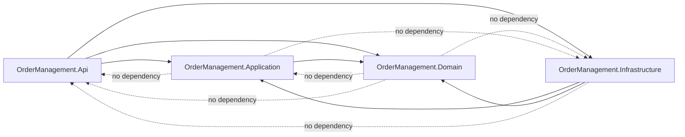

### Dependency Rules

```text
Allowed:
- Api -> Application
- Api -> Infrastructure
- Api -> Domain
- Application -> Domain
- Infrastructure -> Application
- Infrastructure -> Domain

Not allowed:
- Domain -> any other layer
- Application -> Infrastructure
- Application -> Api
- Infrastructure -> Api
```

---

## 4. Runtime Request Pipeline

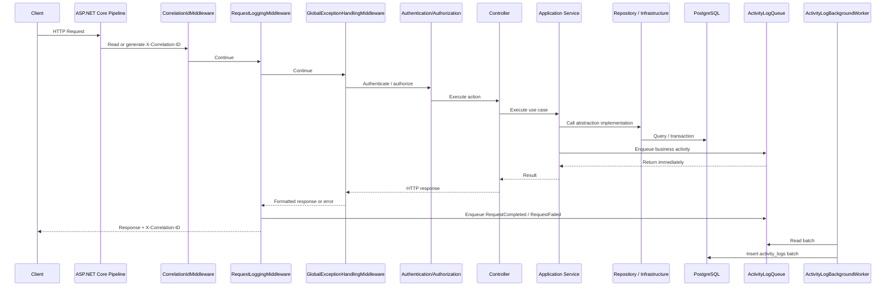

### Middleware Order

```text
1. CorrelationIdMiddleware
2. RequestLoggingMiddleware
3. GlobalExceptionHandlingMiddleware
4. Authentication
5. Authorization
6. Controllers
```

Important:

```text
CorrelationIdMiddleware → RequestLoggingMiddleware → GlobalExceptionHandlingMiddleware.
RequestLogging wraps GlobalExceptionHandling so its finally block can observe the final
response status code after GlobalExceptionHandling has mapped exceptions.
```

---

## 5. Main API Modules

```mermaid
flowchart TD
    API[OrderManagement.Api Controllers]

    API --> AuthController[AuthController]
    API --> ProductsController[ProductsController]
    API --> OrdersController[OrdersController]
    API --> PaymentsController[PaymentsController]
    API --> StoresController[StoresController]
    API --> StoreOperatorsController[StoreOperatorsController]
    API --> BackofficeOrdersController[BackofficeOrdersController]
    API --> BackofficeProductsController[BackofficeProductsController]
    API --> BackofficeDashboardController[BackofficeDashboardController]
    API --> DemoController[DemoController]
    API --> DiagnosticsController[DiagnosticsController]
    API --> ActivityLogsController[ActivityLogsController]
    API --> InternalLogsTestController[InternalActivityLogsTestController]

    AuthController --> AuthService[IAuthService / AuthService]
    ProductsController --> ProductService[IProductService / ProductService]
    OrdersController --> OrderService[IOrderService / OrderService]
    PaymentsController --> PaymentService[IPaymentService / PaymentService]
    StoresController --> StoreService[IStoreService / StoreService]
    StoreOperatorsController --> StoreOperatorService[IStoreOperatorService / StoreOperatorService]
    BackofficeOrdersController --> BackofficeOrderService[IBackofficeOrderService / BackofficeOrderService]
    BackofficeProductsController --> ProductMgmtService[IProductManagementService / ProductManagementService]
    BackofficeDashboardController --> DashboardService[IBackofficeDashboardService / BackofficeDashboardService]
    DemoController --> DemoService[IDemoService / DemoService]
    ActivityLogsController --> ActivityLogQueryService[IActivityLogQueryService / ActivityLogQueryService]
    InternalLogsTestController --> ActivityLogWriter[IActivityLogWriter]

    AuthService --> UserRepository[UserRepository]
    ProductService --> ProductRepository[ProductRepository]
    OrderService --> OrderRepository[OrderRepository]
    PaymentService --> PaymentRepository[PaymentRepository]
    StoreService --> StoreRepository[StoreRepository]
    StoreOperatorService --> StoreMemberRepository[StoreMemberRepository]
    BackofficeOrderService --> OrderRepository
    BackofficeOrderService --> PaymentRepository
    ProductMgmtService --> ProductRepository
    ProductMgmtService --> StoreRepository
    DashboardService --> DashboardRepository[DashboardQueryRepository]
    ActivityLogQueryService --> ActivityLogQueryRepository[ActivityLogQueryRepository]
```

### Controller Routes

```text
Public API:
  AuthController              POST   /api/v1/auth/login
  ProductsController          GET    /api/v1/products
  OrdersController            POST   /api/v1/orders
  OrdersController            GET    /api/v1/orders
  OrdersController            GET    /api/v1/orders/{id}
  OrdersController            PATCH  /api/v1/orders/{id}/status
  OrdersController            POST   /api/v1/orders/{id}/cancel
  PaymentsController          POST   /api/v1/orders/{orderId}/payments
  PaymentsController          GET    /api/v1/orders/{orderId}/payments
  StoresController            POST   /api/v1/stores
  StoresController            GET    /api/v1/stores
  StoresController            GET    /api/v1/stores/{storeId}
  StoresController            PUT    /api/v1/stores/{storeId}
  StoreOperatorsController    GET    /api/v1/stores/{storeId}/operators
  StoreOperatorsController    POST   /api/v1/stores/{storeId}/operators
  StoreOperatorsController    PATCH  /api/v1/stores/{storeId}/operators/{userId}/status

Backoffice API (Admin/Ops):
  BackofficeOrdersController  GET    /api/v1/backoffice/orders
  BackofficeOrdersController  GET    /api/v1/backoffice/orders/{id}
  BackofficeOrdersController  PATCH  /api/v1/backoffice/orders/{id}/status
  BackofficeOrdersController  POST   /api/v1/backoffice/orders/{id}/cancel
  BackofficeProductsController GET   /api/v1/backoffice/products
  BackofficeProductsController GET   /api/v1/backoffice/products/{id}
  BackofficeProductsController POST  /api/v1/backoffice/products
  BackofficeProductsController PUT   /api/v1/backoffice/products/{id}
  BackofficeProductsController PATCH /api/v1/backoffice/products/{id}/status
  BackofficeProductsController POST  /api/v1/backoffice/products/{id}/image
  BackofficeProductsController POST  /api/v1/backoffice/products/{id}/stock/adjust
  BackofficeDashboardController GET  /api/v1/backoffice/dashboard

Diagnostic/Demo API:
  DiagnosticsController       GET    /api/v1/diagnostics/ok
  DiagnosticsController       GET    /api/v1/diagnostics/app-error
  DiagnosticsController       GET    /api/v1/diagnostics/unhandled-error
  DemoController              POST   /api/v1/demo/concurrent-stock-deduction

Internal Operational API (Admin/Ops):
  ActivityLogsController      GET    /api/v1/internal/activity-logs
  InternalActivityLogsTestController POST /api/v1/internal/activity-logs/test

Pages:
  Internal Logs Page          GET    /internal/activity-logs
```

---

## 6. Database Schema Overview

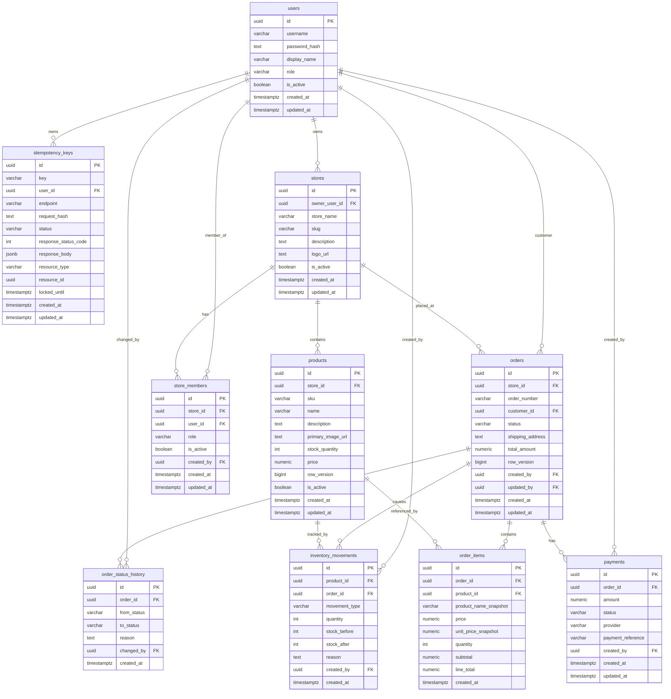

### Domain Entities Map

```text
Table                 Domain Entity         Base Class
users                 User                  AuditableEntity
stores                Store                 AuditableEntity
store_members         StoreMember           AuditableEntity
products              Product               AuditableEntity
orders                Order                 AuditableEntity
order_items           OrderItem             Entity
inventory_movements   InventoryMovement     Entity
order_status_history  OrderStatusHistory    Entity
idempotency_keys      IdempotencyRecord     AuditableEntity
payments              Payment               Entity

Base classes:
  Entity             — Id
  AuditableEntity    — Id, CreatedAt, UpdatedAt
```

---

## 7. Activity Logs Schema Overview

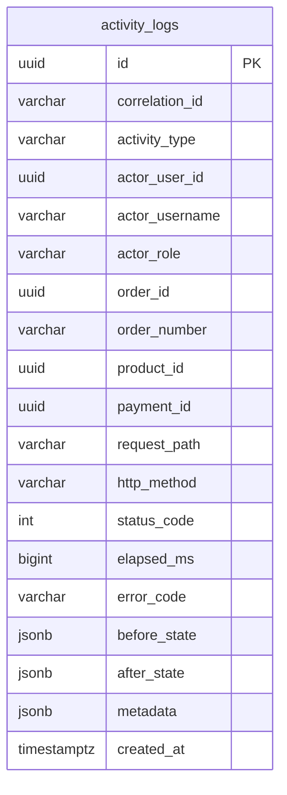

### Activity Log Indexes

```text
idx_activity_logs_correlation_id
idx_activity_logs_activity_type
idx_activity_logs_actor_user_id
idx_activity_logs_order_id
idx_activity_logs_order_number
idx_activity_logs_product_id
idx_activity_logs_payment_id
idx_activity_logs_created_at
idx_activity_logs_error_code
```

---

## 8. Authentication Flow

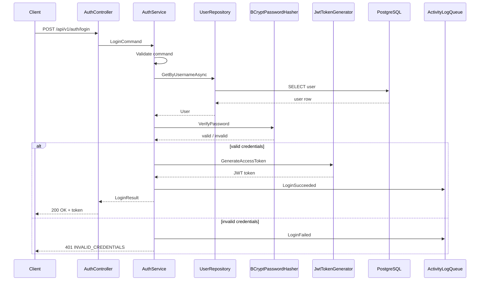

---

## 9. Create Order with Idempotency and Stock Locking

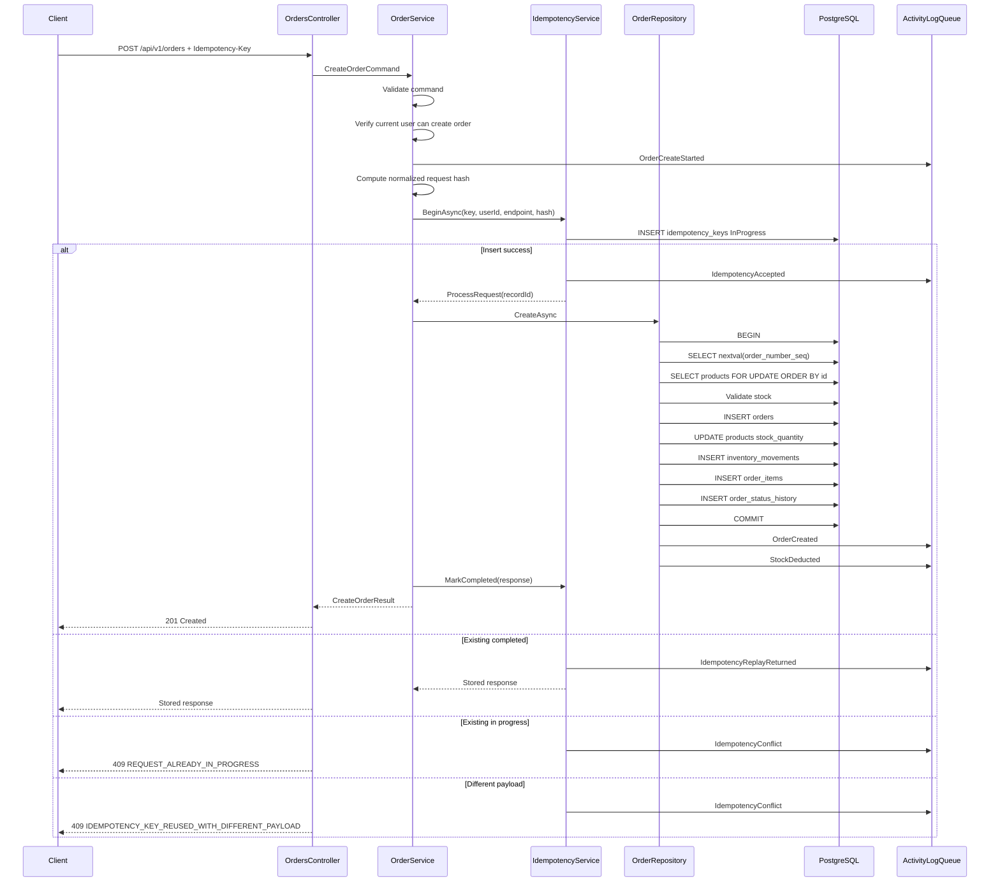

---

## 10. Order Status Update Flow

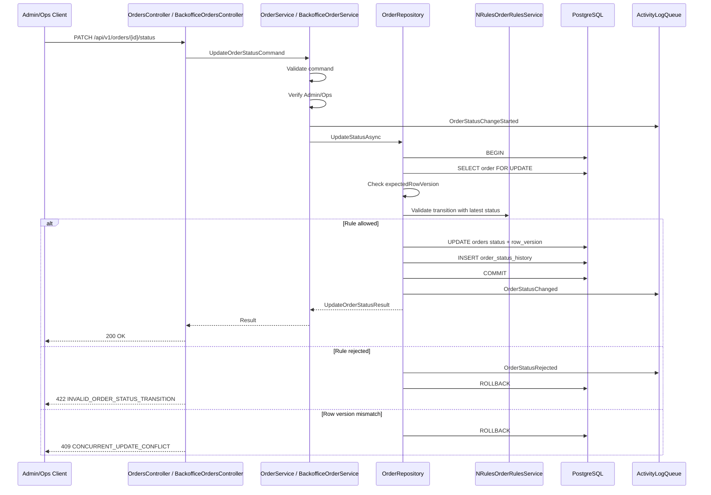

---

## 11. Cancel Order Flow

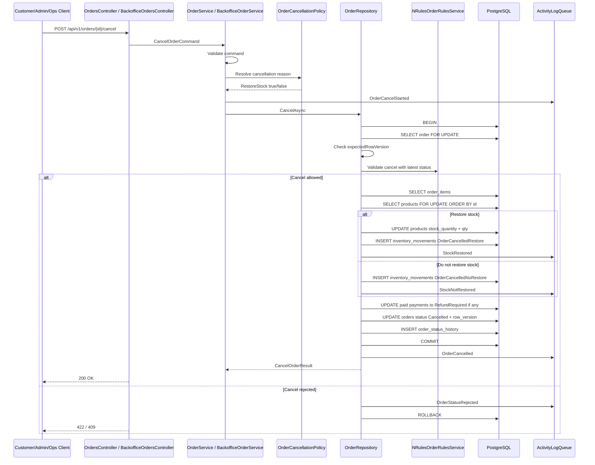

---

## 12. Payment Flow

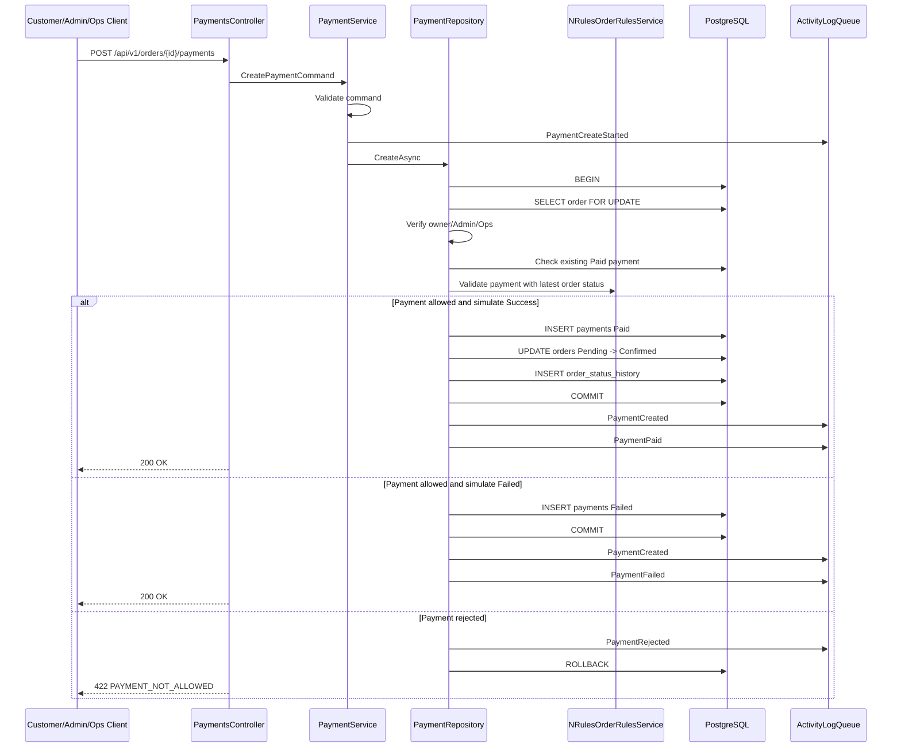

---

## 13. Payment vs Cancel Race

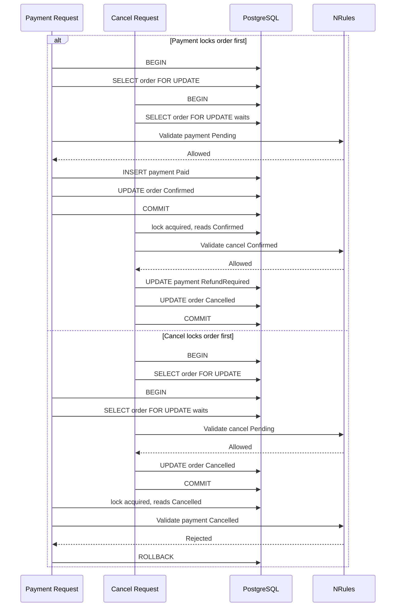

Expected:

```text
The final state is always consistent.
No paid payment remains on cancelled order without refund marker.
No payment succeeds after order is already cancelled.
```

---

## 14. Internal Activity Logs Query Flow

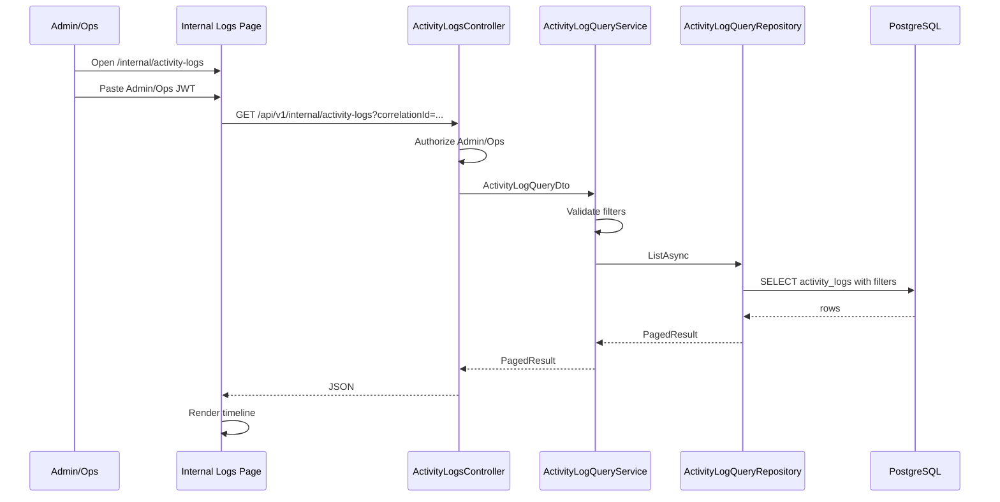

---

## 15. Deployment/Runtime Components

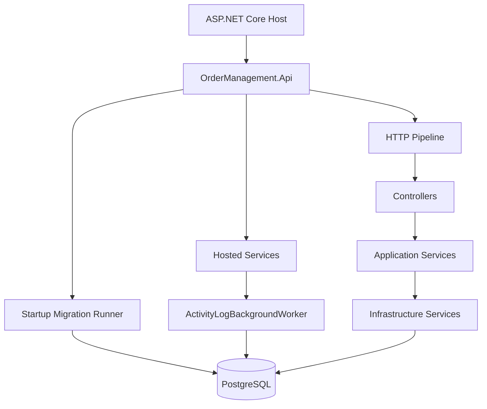

Runtime startup sequence:

```text
1. Build host.
2. Register services and options.
3. Apply database migrations.
4. Start HTTP pipeline.
5. Start hosted background services.
6. Serve API requests.
```

---

## 16. Key Production-Grade Design Points

```text
- Idempotency-Key prevents duplicate order creation.
- PostgreSQL row lock prevents stock race.
- Product lock ordering reduces deadlock risk.
- row_version prevents lost update on order mutation.
- NRules validates lifecycle using latest locked state.
- Cancel endpoint owns all cancellation side effects.
- Payment/cancel race serialized by order row lock.
- Activity logs are async and searchable.
- Internal logs API is Admin/Ops only.
- Sensitive data is not logged.
- Store isolation: operators/scoped to their stores via StoreAuthorizationService.
- Product image uploads validated for size, extension, content-type; stored with GUID filename.
- Request hash comparison detects idempotency key reuse with different payloads.
```

---

## 17. Known Limitations Shown in Architecture

```text
- Payment provider is mocked.
- No distributed message broker yet.
- No outbox pattern yet.
- Idempotency Begin/Create/MarkCompleted are not yet one shared UnitOfWork transaction.
- Activity logs are async best-effort for non-critical tracing.
```

Future improvements:

```text
- Shared UnitOfWork transaction for idempotency + order creation.
- Outbox pattern for integration events.
- OpenTelemetry distributed tracing.
- Activity logs retention and partitioning.
- Rate limiting for login and create order.
```

---

## 18. Domain Base Classes and Value Objects

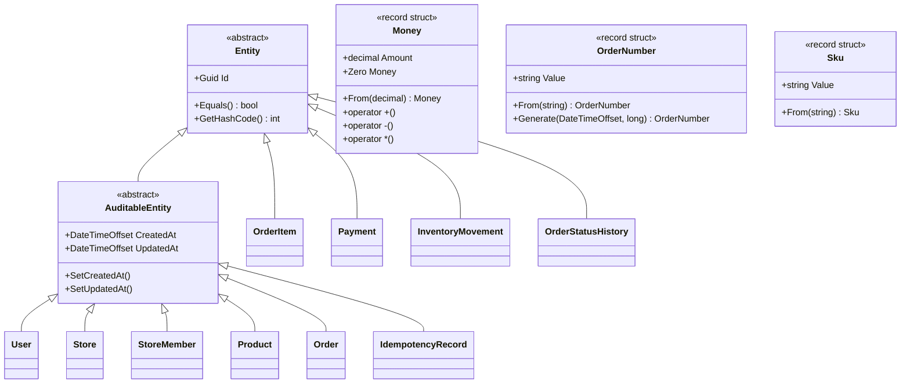

---

## 1. System Context

```mermaid
flowchart TD
    %% Actors
    User[User / Customer / Operator / Admin] --> ClientApps[Client Applications]

    %% Client Applications
    ClientApps --> MVC[ASP.NET MVC Client]
    ClientApps --> Angular[Angular Client]
    ClientApps --> React[React Client]
    ClientApps --> Svelte[Svelte Client]
    ClientApps --> Vue[Vue Client]
    ClientApps --> Postman[Postman / Swagger Client]

    %% API Entry
    MVC --> API[Order Management API<br/>ASP.NET Core Web API]
    Angular --> API
    React --> API
    Svelte --> API
    Vue --> API
    Postman --> API

    %% API Public Capabilities
    API --> Auth[JWT Authentication<br/>Login / Bearer Token]
    API --> Products[Products API<br/>List / Detail]
    API --> Orders[Orders API<br/>Create / Get / List / Status / Cancel]
    API --> Payments[Payments API<br/>Create / List Payments]
    API --> Stores[Stores API<br/>Open / List / Update]
    API --> StoreOperators[Store Operators API<br/>Manage Store Operators]
    API --> Health[Health Check<br/>/health]
    API --> Swagger[Swagger UI<br/>/swagger]

    %% Backoffice API Capabilities
    API --> BackofficeOrders[Backoffice Orders API<br/>List / Detail / Status / Cancel]
    API --> BackofficeProducts[Backoffice Products API<br/>CRUD / Image Upload / Stock Adjust]
    API --> BackofficeDashboard[Backoffice Dashboard API<br/>Summary Statistics]

    %% Demo / Diagnostic Capabilities
    API --> Demo[Demo API<br/>Concurrent Stock Deduction]
    API --> Diagnostics[Diagnostics API<br/>OK / App Error / Unhandled Error]

    %% Internal Operational Capability
    API --> InternalLogsApi[Internal Activity Logs API<br/>Admin/Ops Only]
    InternalLogsPage[Internal Activity Logs Page<br/>/internal/activity-logs] --> InternalLogsApi

    %% Cross-cutting Runtime Concerns
    API --> Correlation[Correlation ID<br/>X-Correlation-ID]
    API --> ErrorHandling[Global Exception Handling<br/>Consistent Error Response]
    API --> RequestLogging[Request Logging<br/>RequestCompleted / RequestFailed]
    API --> ActivityQueue[Activity Log Queue<br/>Bounded Channel]

    %% Background Processing
    ActivityQueue --> ActivityWorker[ActivityLogBackgroundWorker<br/>Batch Insert]

    %% Database
    API --> PostgreSQL[(PostgreSQL Database)]
    ActivityWorker --> PostgreSQL
    InternalLogsApi --> PostgreSQL

    %% Database Tables
    PostgreSQL --> Users[(users)]
    PostgreSQL --> StoresTable[(stores)]
    PostgreSQL --> StoreMembers[(store_members)]
    PostgreSQL --> ProductsTable[(products)]
    PostgreSQL --> OrdersTable[(orders)]
    PostgreSQL --> OrderItems[(order_items)]
    PostgreSQL --> InventoryMovements[(inventory_movements)]
    PostgreSQL --> StatusHistory[(order_status_history)]
    PostgreSQL --> IdempotencyKeys[(idempotency_keys)]
    PostgreSQL --> PaymentsTable[(payments)]
    PostgreSQL --> ActivityLogs[(activity_logs)]
    PostgreSQL --> SchemaMigrations[(schema_migrations)]

    %% Styling
    classDef client fill:#e0f2fe,stroke:#0284c7,color:#0f172a;
    classDef api fill:#ede9fe,stroke:#7c3aed,color:#0f172a;
    classDef internal fill:#fef3c7,stroke:#d97706,color:#0f172a;
    classDef db fill:#dcfce7,stroke:#16a34a,color:#0f172a;
    classDef cross fill:#fce7f3,stroke:#db2777,color:#0f172a;

    class MVC,Angular,React,Svelte,Vue,Postman,ClientApps client;
    class API,Auth,Products,Orders,Payments,Stores,StoreOperators,Health,Swagger api;
    class BackofficeOrders,BackofficeProducts,BackofficeDashboard,Demo,Diagnostics api;
    class InternalLogsApi,InternalLogsPage internal;
    class PostgreSQL,Users,StoresTable,StoreMembers,ProductsTable,OrdersTable,OrderItems,InventoryMovements,StatusHistory,IdempotencyKeys,PaymentsTable,ActivityLogs,SchemaMigrations db;
    class Correlation,ErrorHandling,RequestLogging,ActivityQueue,ActivityWorker cross;
```

### Explanation

System context menggambarkan siapa saja yang berinteraksi dengan sistem dan komponen eksternal/internal apa saja yang terlibat.

```text
Users:
  Customer, Operator, Admin.

Client Applications:
  Bisa berupa ASP.NET MVC, Angular, React, Svelte, Vue, Postman, atau Swagger.

Order Management API:
  Entry point utama untuk semua use case:
  - Login
  - Product list/detail
  - Create order
  - Get/list orders
  - Update status
  - Cancel order
  - Create/list payments
  - Open/manage stores and store operators
  - Backoffice order management (Admin/Ops)
  - Backoffice product CRUD, image upload, stock adjustment
  - Backoffice dashboard summary
  - Demo: concurrent stock deduction scenario
  - Diagnostics: verify API pipeline health
  - Internal activity log tracing

PostgreSQL:
  System of record untuk users, stores, store members, products, orders, order items, payments,
  idempotency records, inventory movements, status history, migrations, dan activity logs.

Internal Activity Logs:
  Digunakan oleh Admin/Ops untuk tracing operasional berdasarkan correlation ID, order ID,
  order number, activity type, actor, dan date range.
```

### Key Runtime Concerns

```text
Authentication:
  API menggunakan JWT Bearer token.

Authorization:
  Internal logs hanya bisa diakses Admin/Ops.
  Customer hanya bisa melihat/mengelola order miliknya sendiri.
  Store operators/scoped ke store masing-masing melalui StoreAuthorizationService.

Correlation:
  Semua request memiliki X-Correlation-ID untuk tracing end-to-end.

Error Handling:
  Semua exception dikonversi ke error response yang konsisten.

Activity Logging:
  Business activity logs dikirim ke bounded in-memory queue dan dipersist oleh background worker.

Persistence:
  PostgreSQL digunakan untuk transactional data, idempotency, audit trail, dan activity logs.
```

### Important Boundaries

```text
Public API:
  /api/v1/auth
  /api/v1/products
  /api/v1/orders
  /api/v1/orders/{id}/payments
  /api/v1/stores
  /api/v1/stores/{storeId}/operators
  /health
  /swagger

Backoffice API (Admin/Ops):
  /api/v1/backoffice/orders
  /api/v1/backoffice/products
  /api/v1/backoffice/dashboard

Demo / Diagnostics:
  /api/v1/demo
  /api/v1/diagnostics

Internal Operational API:
  /api/v1/internal/activity-logs
  /api/v1/internal/activity-logs/test
  /internal/activity-logs

Database Boundary:
  API adalah satu-satunya komponen aplikasi yang mengakses PostgreSQL secara langsung.
```
